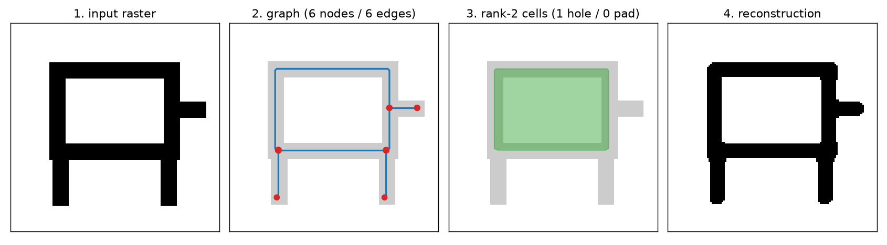

# OpenCompMech

Research code for **generating 2D compliant mechanisms and verifying them with
finite-element analysis**. The organising principle is that a generated design
counts for nothing until a fresh FEA solve says it actually works — so every
number here comes from a solver, never from similarity to a training example.

> **Status: work in progress.** The generation pipeline, the FEA verifier, the
> graph representation and the evaluation protocol are implemented and tested.
> Model comparisons are reported under a frozen protocol, but from a **single
> training seed on a synthetic corpus** — they characterise these two models on
> this data, and are not a benchmark result for CNNs versus GNNs in general. See
> [Evaluation status](#evaluation-status) and
> [What this does not yet establish](#what-this-does-not-yet-establish).

## What this is

A pipeline for building a corpus of 2D compliant mechanisms across five
generator families, and for asking whether a conditional generative model can
propose candidate topologies that survive an independent physics check.

Everything is **normalized 2D linear elasticity**. It is not a manufacturing
dataset, not a validated engineering tool, and makes no claim about any physical
part.

## What is here

**The verification gate is the product.** Most generative-design work reports
similarity to a reference. Here a candidate must pass a full-resolution sparse
FEA screen: connectivity, minimum feature size, no single-pixel hinges, volume
fraction, port attachment, and functional response (does it actually move the
right way, with the right sign and enough stroke). See
[docs/VERIFICATION_PROTOCOL.md](docs/VERIFICATION_PROTOCOL.md).

**A reusable, generator-independent graph representation.** `src/graph/` derives
one canonical graph from the *finished shape* of any mechanism, so all five
families share a single schema. It is SE(2)-equivariant, round-trips back to a
raster for re-verification, and includes an ETNN-style combinatorial-complex
lift (rank-2 cells for holes and anchor pads) validated against Euler's formula.
See [docs/GRAPH_REPRESENTATION.md](docs/GRAPH_REPRESENTATION.md).

**Measured ceilings before model claims.** Before judging any generator, the
pipeline measures what its *representation* can express at all, by pushing
ground-truth designs through the encoder and back and gating the result
(`scripts/graph_ceiling.py`). On this project that ceiling — not the model — was
repeatedly the binding constraint.

**Hard-won hardware notes.** Two silent-corruption failure modes on RDNA4
(gfx1201), including fused AdamW producing negative second moments, with fixes:
[docs/HARDWARE_NOTES_RDNA4.md](docs/HARDWARE_NOTES_RDNA4.md).

## Repository map

```text
src/core/          mesh, problem definition, sparse Cholesky factorization
src/generators/    mechanism generators (5 families, 15 types)
src/solvers/       linear and nonlinear FEA
src/validation/    geometry, connectivity, hinge, port and motion checks
src/ml/            raster model (UNet, rectified flow) + graph model (EGNN)
src/graph/         canonical mechanism graph, ETNN complex lift, PyG export
scripts/           generation, training, evaluation, auditing
tests/             unit tests (graph schema, equivariance, gate policy, harness)
examples/          self-contained quickstart (no corpus or GPU required)
config/            frozen evaluation protocol and split plans
```

## Getting started

No corpus, GPU or trained model is needed to try the graph representation:

```bash
pip install -e ".[graph,viz,dev]"
python examples/quickstart.py        # raster -> graph -> ETNN cells -> raster
pytest tests/ -q                     # the suite runs on CPU
```



`examples/quickstart.py` builds a synthetic shape, converts it with the same
code path every generator family uses, lifts it to a combinatorial complex, and
checks the result against Euler's formula. The graph library has no hard
GNN-framework dependency:

```python
from src.graph import from_raster, to_pyg, build_cells, euler_check

g = from_raster(density, cond=cond, cond_channels=names)   # any family
build_cells(g)                                             # rank-2 ETNN lift
assert euler_check(g)["ok"]                                # bounded faces = E-V+C
data = to_pyg(g)          # torch_geometric Data, or a tensor dict without it
```

Training and evaluation additionally need PyTorch (`pip install -e ".[ml]"`,
with a build matching your accelerator) and a generated corpus.

## Evaluation status

A comparison of the raster (CNN) and graph (GNN) models has been run through
`scripts/compare_models.py`, which drives both models so that specifications,
candidate count, seed schedule and FEA gate are identical by construction.
Specifications come from a frozen protocol artifact
(`scripts/freeze_eval_protocol.py`) whose eligibility rule is applied
mechanically rather than by hand, with disjoint tuning and untouched test sets.

First, **in distribution** — every mechanism type in the test set also appears
in training. **n = 200 held-out specifications, K = 8, training exposure matched
at 2.56M examples, neither model tuned.** 95% percentile-bootstrap CIs over
specs.

| method | pass@1 | pass@8 |
|---|---:|---:|
| `reference_native` (protocol self-check) | 1.000 | 1.000 |
| `raster_raw` | 0.720 [0.655, 0.775] | **0.905** [0.860, 0.945] |
| `raster_projected` | 0.720 [0.655, 0.775] | **0.905** [0.860, 0.945] |
| `graph_raw` | 0.005 [0.000, 0.015] | 0.040 [0.015, 0.070] |
| `graph_repaired` | 0.110 [0.065, 0.150] | **0.335** [0.270, 0.400] |

Three things worth stating plainly:

1. **The raster model wins in distribution**, and not narrowly. The compactness,
   explicit connectivity and built-in equivariance that motivated the graph model
   did not translate into physical validity on familiar mechanism types. (Under a
   family holdout this reverses — see below.)
2. **Most of the graph pipeline's performance is deterministic decoder repair**,
   not learned behaviour (`graph_raw` 0.040 to `graph_repaired` 0.335). The
   raster pipeline needs none — its raw and post-processed numbers are identical.
   Scoring each pipeline twice, raw and repaired, is what makes this visible.
3. **The graph representation is family-dependent.** It matches the raster model
   on linkages and ground-structure trusses and scores 0.00 on SIMP continuum
   families, where a mechanism is a distributed compliant body rather than a
   network of struts. See [docs/GRAPH_MODEL.md](docs/GRAPH_MODEL.md).

### A corrected error

An earlier internal write-up claimed the opposite — that the graph model beat the
raster model at 128px. Both numbers in that claim were wrong. The raster figure
was an evaluation artifact: `guided_sample`'s on-device volume projection
collapses the density at 128px, leaving ~0.08% of pixels above threshold for a
20% volume target, so every candidate failed connectivity. The graph figure came
from a non-comparable specification set predating the frozen protocol. A separate
claim dividing a pass@8 number by a pass@1 ceiling was invalid and is withdrawn.

### Generalization: the ranking reverses

The table above is in-distribution — every mechanism type in the test set also
appears in training. That measures interpolation, and it is the setting a large
convolutional model should be expected to win.

So one entire family was **removed from training** and both models were
retrained from scratch on the reduced corpus at the same matched exposure, then
scored on 200 held-out specifications from the unseen family.

| method | pass@1 | pass@8 |
|---|---:|---:|
| `reference_native` (self-check) | 1.000 | 1.000 |
| `raster_raw` / `raster_projected` | 0.060 [0.030, 0.095] | 0.180 [0.130, 0.235] |
| `graph_raw` | 0.000 [0.000, 0.000] | 0.015 [0.000, 0.035] |
| `graph_repaired` | 0.110 [0.070, 0.155] | **0.400** [0.335, 0.470] |

On an unseen family the graph pipeline more than doubles the raster model, with
disjoint intervals. Per type, with and without the family in training, the
raster model falls from 1.00 to 0.03 on `fact_translation` while the graph
pipeline is statistically unchanged (0.67 to 0.68). The failure modes explain
it: 90% of raster candidates fail the gate's basic *geometry* check — they are
not coherent structures — whereas the graph decoder builds a connected strut
network by construction and fails instead on *function*.

The honest caveat is that `graph_raw` is near zero in both settings, so what
generalizes is largely the representation and its deterministic decoder rather
than the learned model. The supported claim is about the pipeline: constraining
a generative model to a representation that can only express valid structures
buys real out-of-distribution robustness. See
[docs/GRAPH_MODEL.md](docs/GRAPH_MODEL.md).

### What this does not yet establish

- Neither model is tuned. Equal *tuning budgets* (both zero here) make the
  comparison fair, but the absolute numbers are not near a ceiling.
- Single training seed and single sampling-seed schedule, and one held-out
  family. The direction of the generalization result is clear; its magnitude
  rests on one experiment.
- The raster checkpoint in the in-distribution table was resumed mid-run with a
  reset optimizer, making it a capacity probe rather than a clean architecture
  ablation. The holdout checkpoints were trained straight through.
- Per-specification per-method outcomes are not stored in the result artifact,
  so paired significance tests are not possible; the reported intervals are
  percentile bootstrap over specifications.

## Limitations

- **Normalized 2D linear elasticity only.** No material calibration, thickness,
  yield, fatigue, buckling, contact, friction, manufacturing constraints, or
  physical testing. Those are separate validation layers, not footnotes.
- **Synthetic corpus.** The corpus is generated, not measured from real parts.
- **Uneven family coverage.** Parametric families produce far more designs than
  optimization-based ones (throughput, gate yield, and de-duplication of
  near-identical optimizer solutions all differ per family). Absolute rates are
  weighted toward the larger families.
- **One solution per specification.** Per-spec multimodality is unsolved, so the
  corpus cannot currently teach a model that a problem has several good answers.
- **Goal-conditioned, not pure inverse design.** The conditioning vector
  includes performance labels measured from a reference design.
- **The corpus is not distributed here.** Design counts quoted in the docs refer
  to a corpus generated by this code; note that unique *records* and unique
  *binarised topologies* are not identical (a small number of designs collide
  after binarisation).

## License

MIT for the source code — see [LICENSE](LICENSE). The generated corpus is not
included in this repository and would carry its own license.
